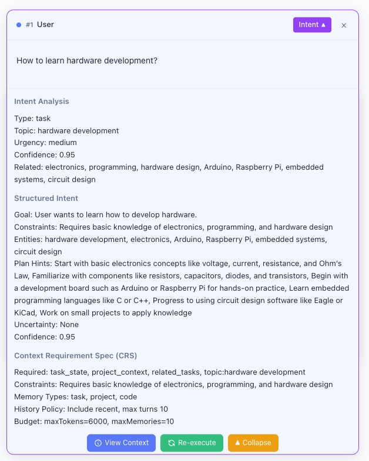

# Intelligent Push-Based Context Management (PCM) System

This project demonstrates the operational effects of the PCM system and is not an actual system implementation.

## Core Problems Solved

In current Agent systems, AI faces issues with unfocused attention when dealing with long contexts. Most existing solutions on the market mainly use sliding window or summary compression methods, but these inevitably face the problem of detail loss.

This solution introduces PCM (Push-Context-Management), which builds and compiles contexts in real-time during user-AI interactions, submitting contexts that directly point to the user's target essence for AI execution, thereby improving AI execution accuracy and solving problems such as unfocused attention and reduced efficiency caused by long contexts.



## Differences

The main difference from external memory systems on the market is that external systems are based on summary compression schemes, extracting core information from long contexts for storage, and retrieving this information to build contexts when users engage in subsequent conversations with AI. The advantages are that it can retain core information in long contexts, allowing AI to perceive historical narratives, and improve AI execution efficiency. The disadvantages are loss of details and inability to solve noise issues.

In contrast, this system does not perform summary compression on historical information, storing it in full, and during subsequent user-AI conversations, it performs real-time user intent recognition and builds contexts based on user intent. Based on this theory, the following innovative breakthroughs have been achieved:
- Historical memory is not lost, historical memory is retrieved as needed
- Contexts pointing directly to goals are built, noise-free, precise AI execution
- The same window can carry multiple topics without manual switching, autonomous topic recognition (similar to humans switching topics during casual chat)
- Multi-task synchronous parallelism, can continue conversations during task execution
- Conversation branches can directly create new conversation branches based on a certain node in the historical conversation to redirect the conversation
- Support for ultra-long tools, MCP, and Skills lists
- Environmental perception involves incorporating information about environmental changes into the context to adapt to these changes
- The entire system can be disguised as a pure LLM service (API), with low integration costs

Disadvantage: Due to the Push mode, contexts are generated in real-time, requiring more computing latency, so it is only suitable for long conversation task scenarios.

## How to Run?

```bash
git clone https://github.com/tangshuang/pcm.git
cd pcm
pnpm install
pnpm dev
```

Then, you can open the local service it starts to experience usage.

You can also use the online website to experience [https://pcm.tangshuang.net](https://pcm.tangshuang.net)

## Paper

[Based on Push-Based Context Management (Push-Context-Management) Intelligent Push-Based Context Management (PCM) System](https://pcm.tangshuang.net/paper)
