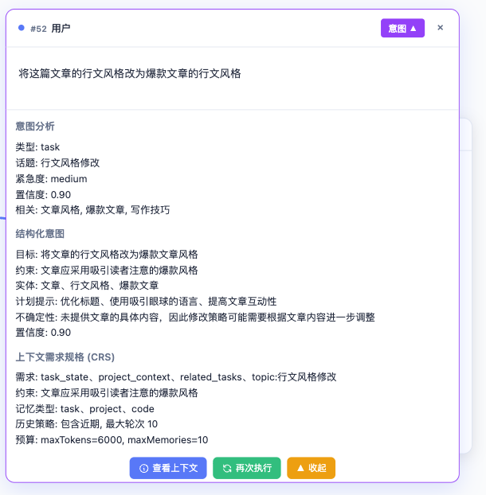

# 智能推送式上下文管理（PCM）系统

本项目演示PCM系统的运行效果，不作为实际系统实现。

## 核心解决的问题

在当前的Agent系统中，AI面临长上下文时注意力不集中的问题。当前市面上的大部分解决方案主要采用滑动窗口或摘要压缩方案，但是，这些方面必然面临细节丢失问题。

本方案通过引入PCM（Push-Context-Management），在用户与AI交流时，实时构建编译上下文，将直指用户目标本质的上下文提交给AI执行，从而提升AI执行的准度，解决长上下文带来的注意力不集中和效率降低等问题。



## 区别

和市面上的外挂记忆系统的主要区别在于，外挂系统基于摘要压缩方案，将从长上下文中提取核心信息，进行存储，在用户与AI进行次轮对话时，再取出这部分信息构建上下文。好处是，既可以满足长上下文时保留核心信息，让AI可以感知历史故事，又可以提升AI执行的效率。缺点是，丢失细节，且无法解决噪声问题。

而本系统不对历史信息作摘要压缩，全量存储，在用户与AI进行次轮对话时，实时的对用户意图进行识别，并基于用户意图进行上下文构建。基于这套理论，做到了如下创新性突破：
- 历史记忆不丢失，按需调取历史记忆
- 构建直指目标的上下文，无噪声，AI的精准执行
- 同一窗口，可承载多话题，且无需人工手动切换，自主识别话题（类似人类闲聊时话题来回切换）
- 多任务同步并行，任务执行过程中，仍然可以继续对话
- 对话分支，可直接基于历史对话中的某个节点，创建新的对话分支，以重新引导对话
- 超长工具、MCP、Skills列表支持
- 环境感知，将环境变化信息加入上下文，以适应环境变化
- 整套系统可伪装为纯LLM服务（API），接入成本低

缺点：由于采取Push模式，上下文实时生成，需要更多的计算延迟，因此，仅适合长对话任务场景。

## 如何运行？

```bash
git clone https://github.com/tangshuang/pcm.git
cd pcm
pnpm install
pnpm dev
```

随后，你可以打开它启动的本地服务来体验使用。

你也可以使用在线网站来体验 [https://pcm.tangshuang.net](https://pcm.tangshuang.net)

## 论文

[智能推送式上下文管理（PCM）与常驻多流交互Agent系统](https://pcm.tangshuang.net/paper)
